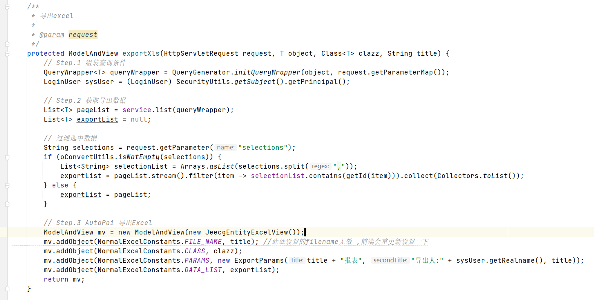
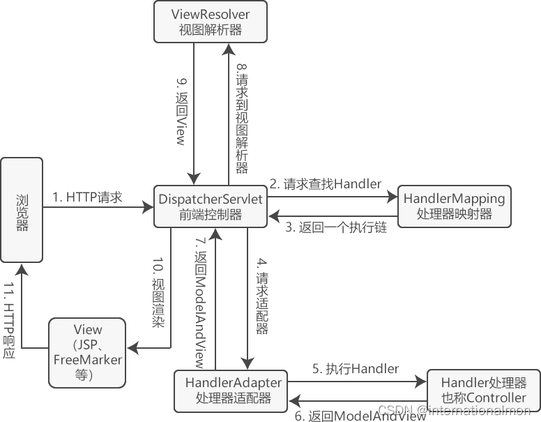
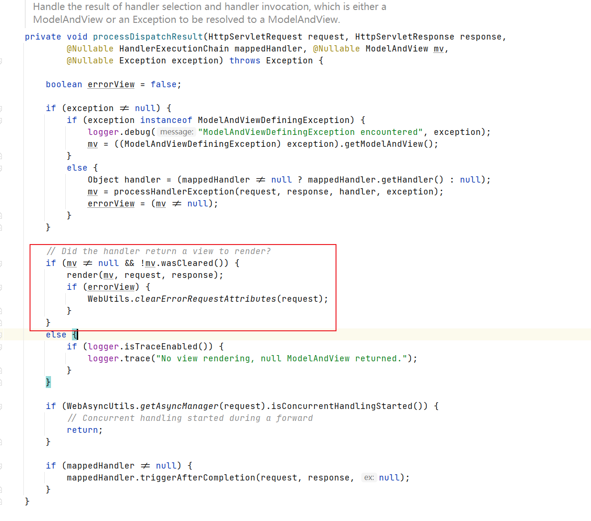
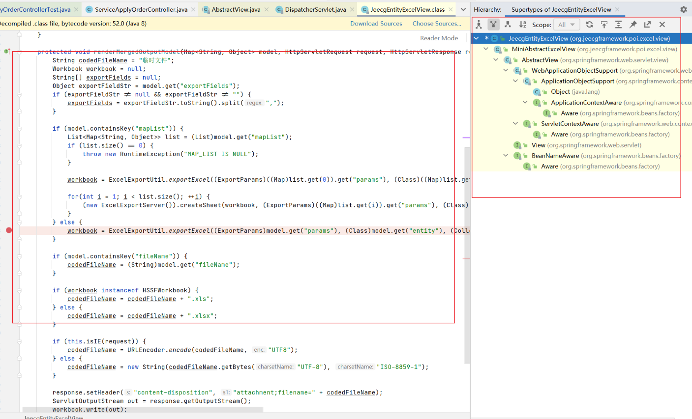

# Spring一种新的生产excel方法
```text
问题引入
```

```text
如上代码，直接返回一个ModelAndView就可以生成Excel了。具体流程是怎么样的呢？
```
# SpringMvc的请求流程

# DispartcherServlet 关键流程
```text
关键方法调用流程:
doService -> doDispatch -> processDispatchResult
```

```java
if (mv != null && !mv.wasCleared()) {
    render(mv, request, response);
    if (errorView) {
        WebUtils.clearErrorRequestAttributes(request);
    }
}
```
```text
在进入processDispatchResult方法的时候，有一个判断mv(类型ModelAndView)，是不是null，是不是不包含任何模型。之后进入render方法
```
```text
关键方法调用流程:
render -> org.springframework.web.servlet.view.AbstractView#render -> org.springframework.web.servlet.view.AbstractView#renderMergedOutputModel
```
```java
renderMergedOutputModel 方法给其实现类去实现，实现生产xls xlsx格式的文件
```
